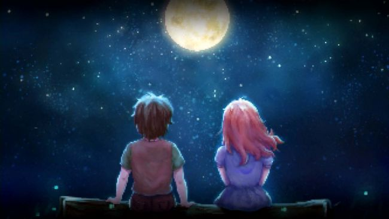

John: [gazing the moon and stars] So… what do you think they really are? The stars, I mean.

River: I… I've never told anyone, but… I've always thought they were lighthouses. Billions of lighthouses…stuck at the far end of the sky.

John: Wow, it must be so lively up there.

River: But it isn't. [John looks to River for a beat] They can see all the other lighthouses out there, and they want to talk to them. But they can't, because they're all too far apart to hear what the others are saying. All they can do…is shine their lights for afar. …So that's what they do. They shine their lights at the other lighthouses, and at me.

John: Why you?

River: Because one day... I'm going to befriend one of them.

